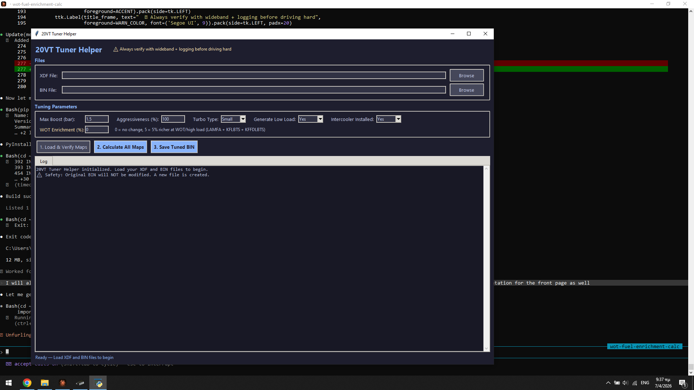

# 20VT Tuner Helper

An open-source tuning calculator for **Bosch ME7 / ME7.5 ECUs**, commonly found in Audi, VW, Skoda, and SEAT 1.8T 20V Turbo engines. It reads your XDF definition and BIN file, calculates optimized maps based on your target boost and tuning parameters, and writes a new tuned BIN — no manual cell-by-cell editing required.



---

## Features

- **Automatic axis detection** — works with any XDF file regardless of axis orientation (RPM as X or Y)
- **Formula-based map calculation** — derived from the ME7 Tuner Wizard spreadsheet, adapted to read actual map axes from your XDF/BIN
- **Dark-themed GUI** — parameter inputs, 3-step workflow, tabbed map viewer with original vs calculated comparison
- **CLI mode** — scriptable command-line interface for advanced users and automation
- **Standalone EXE** — pre-built Windows executable, no Python installation needed

### Maps Calculated

| Map | Description | Method |
|-----|-------------|--------|
| **KFMIRL** | Cylinder load request | Formula: `max_charge * (load/100) * (1 + col_factor + rpm_factor)` |
| **KFMIOP** | Torque operating point (inverse of KFMIRL) | VBA MATCH-based interpolation |
| **KFZWOP / KFZWOP2** | Ignition timing reference | Re-interpolated to new load axis with smoothing |
| **LDRXN** | Max boost request ceiling | `ROUNDUP(max_kfmirl + 1)` per RPM |
| **LDRXNZK** | Boost request with knock reduction | `LDRXN * 0.85` |
| **KFLDHBN** | Max boost pressure ratio (intercooler) | RPM taper + temperature derating + headroom |
| **LAMFA** | WOT preventive enrichment | `lambda * (1 - enrichment%)` above torque threshold |
| **KFLBTS** | EGT component protection lambda | `lambda * (1 - enrichment%)` above load threshold |
| **KFFDLBTS** | Knock-based enrichment weighting | `factor * (1 + enrichment%)` above load threshold |

---

## Quick Start

### Option 1: Run the EXE (no install)

Download `20VT Tuner Helper.exe` from [Releases](../../releases) and run it.

### Option 2: Run from source

```
pip install pyinstaller   # only needed if you want to build the exe yourself
python me7_gui.py
```

No additional dependencies — uses only Python standard library (tkinter, json, xml, math).

### Option 3: CLI

```bash
python me7_tune.py <xdf_path> <bin_path> <action> [args]

# List available maps
python me7_tune.py tune.xdf stock.bin list_maps

# Calculate KFMIRL (1.2 bar boost, 80% aggressiveness, small turbo, generate low load)
python me7_tune.py tune.xdf stock.bin calc_kfmirl 1.2 80 small true

# Calculate all and save
python me7_tune.py tune.xdf stock.bin calc_kfmiop
python me7_tune.py tune.xdf stock.bin calc_kfzwop KFZWOP
python me7_tune.py tune.xdf stock.bin calc_ldrxn
python me7_tune.py tune.xdf stock.bin save_bin output_tuned.bin
```

---

## Parameters

| Parameter | Range | Description |
|-----------|-------|-------------|
| **Max Boost** | 0 - 3 bar | Target boost pressure. 0.8 = stock K03, 1.5 = K04, 2.0+ = GT28/GT30 |
| **Aggressiveness** | 0 - 135% | How aggressively load values scale. 50% = moderate, 100% = full |
| **Turbo Type** | Small / Large | Small = K03/K04 (high-RPM taper). Large = GT28+ (low-RPM spool lag) |
| **Generate Low Load** | Yes / No | Recalculate the 0-15% load region or keep stock values |
| **Intercooler Installed** | Yes / No | When Yes, calculates KFLDHBN (boost pressure limit with temp derating) |
| **WOT Enrichment** | 0 - 20% | Extra fuel enrichment at WOT / high load for detonation protection |

---

## How It Works

### Core Formula (KFMIRL)

```
max_charge = 110 + boost_bar * 66.7

For each cell at (RPM, load%):
    base = max_charge * (load / 100) - 10 + (RPM / max_RPM) * 10
    new_value = base * (1 + load_factor + rpm_factor)
```

Where `load_factor` and `rpm_factor` are lookup tables derived from the ME7 Tuner Wizard spreadsheet that shape the response curve based on aggressiveness and turbo type.

### Axis Auto-Detection

Different XDF files define axes differently — some have X=RPM / Y=Load, others have X=Load / Y=RPM. The calculator detects which axis is RPM by checking:

1. **Units string** — matches `RPM`, `U/min`, `Upm`, `1/min`, `Drehzahl`
2. **Value ranges** — RPM values are typically 300-8000, load/torque values are 0-200%

This means it works with XDF files from different authors and ECU variants without modification.

### ME7 Enrichment Priority

The ECU always picks the **richest** (lowest lambda) from three sources:

```
Final Lambda = MIN(lamfa_w, lamfawkr, lambts)
```

The enrichment calculator modifies LAMFA (preventive at WOT), KFLBTS (reactive at high EGT), and KFFDLBTS (knock-responsive weighting) to provide richer mixtures under high load/boost.

### Safety Limits

- **Lambda floor**: 0.65 (AFR ~9.5) — enrichment never goes below this
- **KFFDLBTS cap**: 2.0 — no benefit beyond this factor
- **KFLDHBN clamp**: 4-35 PSI — within ME7 hard limits (~2560 mbar)
- **LDORXN**: Always calculated below LDRXN (overboost protection)

---

## File Structure

```
me7_gui.py          — GUI application (tkinter)
me7_tune.py         — CLI orchestrator and session management
tuning_calc.py      — Core map calculations (KFMIRL, KFMIOP, KFZWOP, LDRXN)
kfldhbn_calc.py     — KFLDHBN boost pressure ratio calculator
enrichment_calc.py  — LAMFA / KFLBTS / KFFDLBTS fuel enrichment calculator
ldorxn_calc.py      — LDORXN overboost protection calculator
xdf_parser.py       — TunerPro XDF file parser
bin_handler.py      — ECU binary read/write with XDF-defined scaling
```

---

## Tested With

- Audi A4 B6 1.8T 20V (8E0909518AF) — ME7.5
- VW Golf 4 1.8T 20V (06A906032HJ) — ME7.5
- Should work with any ME7/ME7.5 XDF that defines the standard map names

---

## Building the EXE

```bash
pip install pyinstaller

pyinstaller --onefile --windowed --name "20VT Tuner Helper" \
    --add-data "tuning_calc.py;." \
    --add-data "bin_handler.py;." \
    --add-data "xdf_parser.py;." \
    --add-data "kfldhbn_calc.py;." \
    --add-data "ldorxn_calc.py;." \
    --add-data "enrichment_calc.py;." \
    --hidden-import=tuning_calc \
    --hidden-import=bin_handler \
    --hidden-import=xdf_parser \
    --hidden-import=kfldhbn_calc \
    --hidden-import=ldorxn_calc \
    --hidden-import=enrichment_calc \
    me7_gui.py
```

Output: `dist/20VT Tuner Helper.exe` (~12 MB standalone)

---

## References

- [s4wiki.com/wiki/Tuning](https://s4wiki.com/wiki/Tuning) — ME7 map documentation, formulas, and limits
- [AliantAuto ME7.5 Stage 2 Guide](https://aliantauto.com/ecu-remap-guide-me7-5-audi-a4-b6-1-8-20v-163hp-stage-2/) — Practical tuning walkthrough and safety guidelines
- ME7 Tuner Wizard spreadsheet — Original formulas for KFMIRL/KFMIOP/KFZWOP calculation

---

## Disclaimer

This software modifies engine control parameters. Incorrect values can cause engine damage, catalytic converter failure, or turbo failure. **Always**:

- Verify changes with a wideband O2 sensor and data logging before driving hard
- Start with conservative values and increase gradually
- Monitor knock retard, EGT, and AFR under load
- Ensure injector and fuel system capacity matches target load values
- The original BIN file is never overwritten — a new file is always created

Use at your own risk. The authors assume no liability for damage resulting from use of this software.

---

## License

MIT License — see [LICENSE](LICENSE) for details.
